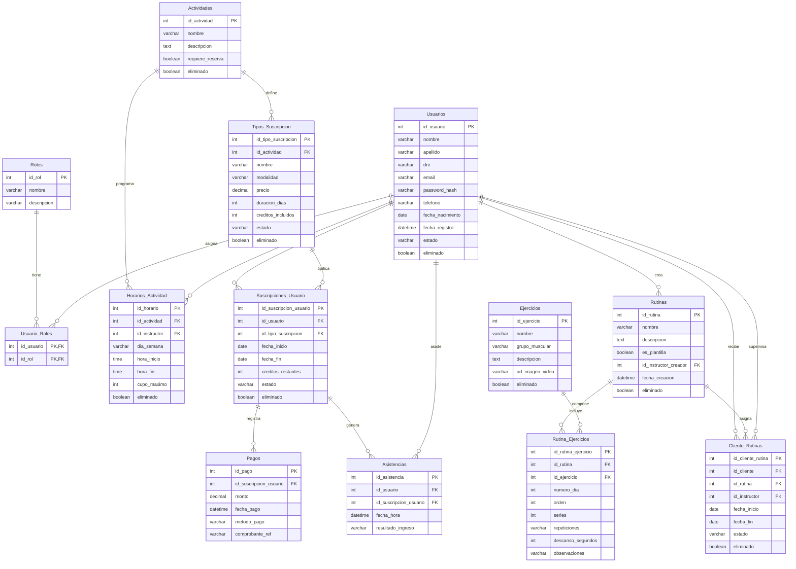

# 📐 SEGUNDA ENTREGA: DISEÑO Y MÓDULOS

**Proyecto:** Sistema de Gestión de Gimnasios, Suscripciones y Rutinas Digitales  
**Asignatura:** Trabajo Final Integrador (TFI) — Tecnicatura Universitaria en Desarrollo de Software  
**Estudiantes:** Fulladoza, Pablo Facundo - Noguera Ríos, Joana Soledad - Lauk, Karen Yamila
**Fecha de Entrega:** Hasta el 27 de Septiembre  

---

## 📌 1. INTRODUCCIÓN Y CONTEXTO DEL PROYECTO

El presente documento constituye la documentación formal de la **Segunda Entrega (Análisis, Diseño de Base de Datos, Módulos y Arquitectura)** para el proyecto final de carrera.

El objetivo del sistema es resolver las **ineficiencias toleradas** en la administración habitual de los gimnasios: el control informal de pagos, la falta de visibilidad en el estado de cuenta de los afiliados, el desperdicio de tiempo en la entrega impresa de rutinas y la desorganización mediante canales de mensajería personales. Buscamos ofrecer una plataforma centralizada y ágil tanto para administradores como para profesores y socios. 

En estricto cumplimiento con las normas de la 2.ª Entrega, este documento **no incluye código funcional de implementación**, sino los esquemas de diseño relacional, la especificación de módulos y la justificación arquitectónica necesaria para iniciar la fase de construcción.   

---

## 🗄️ 2. ESQUEMA COMPLETO DE BASE DE DATOS (MySQL)

Se ha optado por implementar la totalidad del sistema sobre la base de datos relacional **MySQL 8.0**, garantizando **integridad transaccional (ACID)** para la gestión de cuentas y pagos, así como una estructura normalizada en **3.ª Forma Normal (3FN)**.

### 2.1. Aclaraciones de Diseño y Patrones Aplicados

1. **Nivel de la Banderilla `es_plantilla` (Cabezal vs. Detalle):**  
   `es_plantilla` se ubica en la tabla cabecera `Rutinas` porque define si la estructura completa es una **plantilla maestra reutilizable** (disponible en el catálogo global) o si es una **instancia de rutina individual** (personalizada para un cliente). Ubicarla en la tabla intermedia `Rutina_Ejercicios` generaría redundancia innecesaria al repetir el flag para cada uno de los ejercicios que la componen.
2. **Función del Campo `orden` en `Rutina_Ejercicios`:**  
   Establece la **secuencia cronológica exacta** de ejecución de los ejercicios dentro de un mismo bloque o `numero_dia` (ej: 1.° Press de Banca, 2.° Press Inclinado, 3.° Flexiones). Sin esta columna, la base de datos devolvería los ejercicios en orden arbitrario o de inserción, rompiendo la progresión lógica del entrenamiento.
3. **Mecanismo de Borrado Lógico (*Soft Delete*):**  
   Para preservar la auditoría histórica de cobros, asistencias e historiales de entrenamiento, se incorporan las columnas `eliminado BOOLEAN DEFAULT FALSE` en las entidades principales (`Usuarios`, `Actividades`, `Tipos_Suscripcion`, `Ejercicios`, `Rutinas`). De este modo, la eliminación de un usuario o ejercicio desde la interfaz ejecuta un `UPDATE ... SET eliminado = TRUE` en lugar de un `DELETE` destructivo que rompería la integridad de datos o fallaría por restricciones de claves foráneas.
4. **Relación Múltiple de Roles (`Usuario_Roles` N:M):**
    Se aplica el patrón de **Control de Acceso Basado en Roles (RBAC)** de forma extensible lo que permite que una misma persona física asuma múltiples funciones simultáneas dentro del gimnasio (por ejemplo, un `Instructor` que también entrena como `Cliente`, o un `Administrador` que dicta clases). De este modo, la API REST puede evaluar permisos de forma granular sin duplicar registros de usuarios.
5. **Desacoplamiento Catálogo vs. Instancia (`Tipos_Suscripcion` vs. `Suscripciones_Usuario`):**
    Se separa la definición comercial del plan (`Tipos_Suscripcion`) de la contratación individual del alumno (`Suscripciones_Usuario`). Al contratar un pase, la vigencia y los créditos se guardan de forma independiente. Esto protege la estabilidad de los contratos vigentes: si la administración decide modificar precios o duraciones en el tarifario, las suscripciones activas de los socios no sufren alteraciones retroactivas.
6. **Política Diferenciada de Integridad Referencial (`CASCADE` vs. `SET NULL` vs. *Soft Delete*):**
    Se aplica una política diferenciada según el impacto del dato:
    * **ON DELETE CASCADE** en tablas dependientes secundarias cuya existencia no tiene sentido sin el padre (ej. borrar las filas de `Rutina_Ejercicios` si se elimina físicamente la cabecera `Rutinas`).
    * **ON DELETE SET NULL** en asignaciones de personal u opcionales (ej. `id_instructor` en `Horarios_Actividad` o `id_actividad` en `Tipos_Suscripcion`), garantizando que la baja de un profesor o actividad no elimine la grilla horaria ni la categoría de cobro.
    * **borrado lógico (** **eliminado = TRUE** **)** en las entidades maestras (`Usuarios`, `Actividades`, `Tipos_Suscripcion`) para impedir la pérdida de datos en cascada hacia comprobantes y asistencias.
7. **Diagnóstico y seguridad en tiempo real en la tabla `Asistencias`:**
    El campo resultado_ingreso (con estados como `Permitido`, `Denegado_Impago` o `Denegado_SinCreditos`) transforma la terminal de la tablet en una herramienta de auditoría. Permite registrar no solo los ingresos exitosos, sino también medir el flujo de intentos fallidos, auditar accesos no autorizados y resolver al instante cualquier reclamo en el mostrador.
---

### 2.2. Diagrama de Entidad-Relación (`DER`)
El siguiente diagrama refleja visualmente la estructura de las tablas, claves primarias (PK), claves foráneas (FK) y sus respectivas cardinalidades:




Link (url) del der realizado en mermaid.live.editor:
https://mermaid.ai/app/projects/9adef96b-020c-416e-96e2-7fd091fd69e9/diagrams/b7d94ff9-a7ee-4be2-929d-82dac8a504d7/version/v0.1/edit

--- 

### 2.3. Script DDL de Creación de Base de Datos (`schema.sql`)

```sql
-- =============================================================================
-- SCRIPT DE CREACIÓN DE BASE DE DATOS - GIMNASIO TFI (MySQL 8.0)
-- Ubicación en Repositorio: /database/schema.sql
-- Incluye Soporte para Borrado Lógico (Soft Delete)
-- =============================================================================

CREATE DATABASE IF NOT EXISTS gimnasio_db 
CHARACTER SET utf8mb4 
COLLATE utf8mb4_unicode_ci;

USE gimnasio_db;

-- -----------------------------------------------------------------------------
-- 1. MÓDULO DE USUARIOS Y ROLES
-- -----------------------------------------------------------------------------

CREATE TABLE Roles (
    id_rol INT AUTO_INCREMENT PRIMARY KEY,
    nombre VARCHAR(50) NOT NULL UNIQUE,
    descripcion VARCHAR(255)
) ENGINE=InnoDB;

INSERT INTO Roles (nombre, descripcion) VALUES
('Administrador', 'Acceso total a gestión de usuarios, suscripciones y reportes'),
('Instructor', 'Creación y asignación de rutinas y ejercicios'),
('Cliente', 'Consulta de rutinas y estado de cuenta desde interfaz web/móvil');

CREATE TABLE Usuarios (
    id_usuario INT AUTO_INCREMENT PRIMARY KEY,
    nombre VARCHAR(100) NOT NULL,
    apellido VARCHAR(100) NOT NULL,
    dni VARCHAR(20) NOT NULL UNIQUE,
    email VARCHAR(150) NOT NULL UNIQUE,
    password_hash VARCHAR(255) NOT NULL,
    telefono VARCHAR(30),
    fecha_nacimiento DATE NOT NULL,
    fecha_registro DATETIME DEFAULT CURRENT_TIMESTAMP,
    estado ENUM('Activo', 'Inactivo') DEFAULT 'Activo',
    eliminado BOOLEAN DEFAULT FALSE,
    INDEX idx_dni (dni),
    INDEX idx_email (email),
    INDEX idx_eliminado (eliminado)
) ENGINE=InnoDB;

CREATE TABLE Usuario_Roles (
    id_usuario INT NOT NULL,
    id_rol INT NOT NULL,
    PRIMARY KEY (id_usuario, id_rol),
    FOREIGN KEY (id_usuario) REFERENCES Usuarios(id_usuario) ON DELETE CASCADE,
    FOREIGN KEY (id_rol) REFERENCES Roles(id_rol) ON DELETE CASCADE
) ENGINE=InnoDB;

-- -----------------------------------------------------------------------------
-- 2. MÓDULO DE ACTIVIDADES, SUSCRIPCIONES Y PAGOS
-- -----------------------------------------------------------------------------

CREATE TABLE Actividades (
    id_actividad INT AUTO_INCREMENT PRIMARY KEY,
    nombre VARCHAR(100) NOT NULL UNIQUE,
    descripcion TEXT,
    requiere_reserva BOOLEAN DEFAULT FALSE,
    eliminado BOOLEAN DEFAULT FALSE
) ENGINE=InnoDB;

CREATE TABLE Horarios_Actividad (
    id_horario INT AUTO_INCREMENT PRIMARY KEY,
    id_actividad INT NOT NULL,
    dia_semana ENUM('Lunes', 'Martes', 'Miércoles', 'Jueves', 'Viernes', 'Sábado') NOT NULL,
    hora_inicio TIME NOT NULL,
    hora_fin TIME NOT NULL,
    cupo_maximo INT DEFAULT 15,
    id_instructor INT,
    eliminado BOOLEAN DEFAULT FALSE,
    FOREIGN KEY (id_actividad) REFERENCES Actividades(id_actividad) ON DELETE CASCADE,
    FOREIGN KEY (id_instructor) REFERENCES Usuarios(id_usuario) ON DELETE SET NULL
) ENGINE=InnoDB;

CREATE TABLE Tipos_Suscripcion (
    id_tipo_suscripcion INT AUTO_INCREMENT PRIMARY KEY,
    id_actividad INT,
    nombre VARCHAR(100) NOT NULL,
    modalidad ENUM('Pase Libre', 'Por Créditos', 'Clases Semanales') NOT NULL,
    precio DECIMAL(10, 2) NOT NULL,
    duracion_dias INT NOT NULL DEFAULT 30,
    creditos_incluidos INT DEFAULT NULL,
    estado ENUM('Activo', 'Inactivo') DEFAULT 'Activo',
    eliminado BOOLEAN DEFAULT FALSE,
    FOREIGN KEY (id_actividad) REFERENCES Actividades(id_actividad) ON DELETE SET NULL
) ENGINE=InnoDB;

CREATE TABLE Suscripciones_Usuario (
    id_suscripcion_usuario INT AUTO_INCREMENT PRIMARY KEY,
    id_usuario INT NOT NULL,
    id_tipo_suscripcion INT NOT NULL,
    fecha_inicio DATE NOT NULL,
    fecha_fin DATE NOT NULL,
    creditos_restantes INT DEFAULT NULL,
    estado ENUM('Activa', 'Vencida', 'Agotada', 'Cancelada') DEFAULT 'Activa',
    eliminado BOOLEAN DEFAULT FALSE,
    FOREIGN KEY (id_usuario) REFERENCES Usuarios(id_usuario),
    FOREIGN KEY (id_tipo_suscripcion) REFERENCES Tipos_Suscripcion(id_tipo_suscripcion),
    INDEX idx_usuario_estado (id_usuario, estado, eliminado)
) ENGINE=InnoDB;

CREATE TABLE Pagos (
    id_pago INT AUTO_INCREMENT PRIMARY KEY,
    id_suscripcion_usuario INT NOT NULL,
    monto DECIMAL(10, 2) NOT NULL,
    fecha_pago DATETIME DEFAULT CURRENT_TIMESTAMP,
    metodo_pago ENUM('Efectivo', 'Transferencia', 'MercadoPago', 'Tarjeta') NOT NULL,
    comprobante_ref VARCHAR(100),
    FOREIGN KEY (id_suscripcion_usuario) REFERENCES Suscripciones_Usuario(id_suscripcion_usuario)
) ENGINE=InnoDB;

CREATE TABLE Asistencias (
    id_asistencia INT AUTO_INCREMENT PRIMARY KEY,
    id_usuario INT NOT NULL,
    id_suscripcion_usuario INT,
    fecha_hora DATETIME DEFAULT CURRENT_TIMESTAMP,
    resultado_ingreso ENUM('Permitido', 'Denegado_Impago', 'Denegado_SinCreditos', 'Denegado_Inexistente') NOT NULL,
    FOREIGN KEY (id_usuario) REFERENCES Usuarios(id_usuario),
    FOREIGN KEY (id_suscripcion_usuario) REFERENCES Suscripciones_Usuario(id_suscripcion_usuario) ON DELETE SET NULL,
    INDEX idx_fecha (fecha_hora)
) ENGINE=InnoDB;

-- -----------------------------------------------------------------------------
-- 3. MÓDULO DE EJERCICIOS Y RUTINAS
-- -----------------------------------------------------------------------------

CREATE TABLE Ejercicios (
    id_ejercicio INT AUTO_INCREMENT PRIMARY KEY,
    nombre VARCHAR(120) NOT NULL UNIQUE,
    grupo_muscular ENUM('Pecho', 'Espalda', 'Pierna', 'Hombros', 'Bíceps', 'Tríceps', 'Abdomen', 'Cardio', 'FullBody') NOT NULL,
    descripcion TEXT,
    url_imagen_video VARCHAR(255),
    eliminado BOOLEAN DEFAULT FALSE
) ENGINE=InnoDB;

CREATE TABLE Rutinas (
    id_rutina INT AUTO_INCREMENT PRIMARY KEY,
    nombre VARCHAR(120) NOT NULL,
    descripcion TEXT,
    es_plantilla BOOLEAN DEFAULT FALSE,
    id_instructor_creador INT NOT NULL,
    fecha_creacion DATETIME DEFAULT CURRENT_TIMESTAMP,
    eliminado BOOLEAN DEFAULT FALSE,
    FOREIGN KEY (id_instructor_creador) REFERENCES Usuarios(id_usuario)
) ENGINE=InnoDB;

CREATE TABLE Rutina_Ejercicios (
    id_rutina_ejercicio INT AUTO_INCREMENT PRIMARY KEY,
    id_rutina INT NOT NULL,
    id_ejercicio INT NOT NULL,
    numero_dia INT NOT NULL DEFAULT 1,
    orden INT NOT NULL DEFAULT 1,
    series INT NOT NULL DEFAULT 3,
    repeticiones VARCHAR(50) NOT NULL DEFAULT '10-12',
    descanso_segundos INT DEFAULT 60,
    observaciones VARCHAR(255),
    FOREIGN KEY (id_rutina) REFERENCES Rutinas(id_rutina) ON DELETE CASCADE,
    FOREIGN KEY (id_ejercicio) REFERENCES Ejercicios(id_ejercicio)
) ENGINE=InnoDB;

CREATE TABLE Cliente_Rutinas (
    id_cliente_rutina INT AUTO_INCREMENT PRIMARY KEY,
    id_cliente INT NOT NULL,
    id_rutina INT NOT NULL,
    id_instructor INT NOT NULL,
    fecha_inicio DATE NOT NULL,
    fecha_fin DATE,
    estado ENUM('Activa', 'Finalizada', 'Cancelada') DEFAULT 'Activa',
    eliminado BOOLEAN DEFAULT FALSE,
    FOREIGN KEY (id_cliente) REFERENCES Usuarios(id_usuario),
    FOREIGN KEY (id_rutina) REFERENCES Rutinas(id_rutina),
    FOREIGN KEY (id_instructor) REFERENCES Usuarios(id_usuario)
) ENGINE=InnoDB;
```

---

## 🧩 3. LISTADO DE MÓDULOS FUNCIONALES Y PRIORIDADES

Para estructurar los sprints de desarrollo, el sistema se compone de **6 módulos funcionales** priorizados:

### Módulo 1: Autenticación y Control de Accesos (Prioridad: ALTA)
* **M1.1 Login de Usuarios:** Autenticación mediante email/DNI y contraseña con JWT (*JSON Web Tokens*).
* **M1.2 Control de Roles:** *Middlewares* en Express para restringir rutas según los roles (`Administrador`, `Instructor`, `Cliente`).
* **M1.3 Gestión de Usuarios:** Registro, edición de datos personales (incluyendo `fecha_nacimiento`) y borrado lógico (`SET eliminado = TRUE`).

### Módulo 2: Gestión de Suscripciones y Tarifarios (Prioridad: ALTA)
* **M2.1 Parametrización de Planes:** Alta de tipos de suscripción (`Pase Libre`, `Créditos`, `Clases Semanales`) asociadas o no a actividades específicas.
* **M2.2 Venta y Renovación:** Alta de `Suscripciones_Usuario` asociadas a un cliente con cálculo automático de fecha de vencimiento y carga de créditos.

### Módulo 3: Gestión de Pagos y Cuentas Corrientes (Prioridad: ALTA)
* **M3.1 Registro de Cobros:** Asignación de pagos recibidos a suscripciones activas.
* **M3.2 Alertas de Vencimiento/Impago:** Consultas para identificar afiliados con pagos pendientes o créditos agotados.

### Módulo 4: Control de Asistencia en Tablet (Prioridad: ALTA)
* **M4.1 Terminal de Ingreso (Tablet):** Interfaz simplificada donde el afiliado digita su DNI.
* **M4.2 Motor de Validación:** Verificación en tiempo real del estado de cuenta (`Suscripciones_Usuario`). Descuento automático de 1 crédito en pases por crédito/clases y registro en `Asistencias`.

### Módulo 5: Catálogo y Prescripción de Rutinas (Prioridad: MEDIA-ALTA)
* **M5.1 Banco de Ejercicios:** CRUD de ejercicios con asignación de grupo muscular, enlaces multimedia y baja lógica.
* **M5.2 Creador de Plantillas Globales:** Creación de rutinas estándar (`es_plantilla = TRUE`) abiertas a todos los clientes.
* **M5.3 Asignación y Personalización:** Herramienta para que el instructor clone una plantilla y la adapte a las necesidades específicas de un cliente asignándola en `Cliente_Rutinas`.

### Módulo 6: Interfaz Móvil de Consulta para Afiliados (Prioridad: MEDIA)
* **M6.1 Consulta de Estado de Cuenta:** Pantalla responsive para ver pases activos, fechas de vencimiento y créditos disponibles.
* **M6.2 Visor de Rutinas:** Acceso a rutinas personalizadas asignadas y al catálogo de rutinas globales por número de día (`Día 1`, `Día 2`, etc.), con detalle de series, repeticiones y videos presentados en el orden correspondiente (`orden`).

---

## 🏗️ 4. ARQUITECTURA DEL SISTEMA Y JUSTIFICACIÓN TÉCNICA

### 4.1. Patrón Arquitectónico: Cliente-Servidor de 3 Capas (API REST)
Se implementa una arquitectura desacoplada basada en servicios Web:
1. **Capa de Presentación (Frontend):** Interfaz Web Responsiva basada en HTML5, CSS3 (Bootstrap/Tailwind) y JavaScript (ES6+), adaptada tanto para navegadores de escritorio (Administrador/Instructor) como para dispositivos móviles (Clientes y Tablet de entrada).
2. **Capa de Lógica de Negocio (Backend API REST):** Desarrollada sobre **Node.js** con la librería **Express**. Se estructura bajo el patrón MVC/Capas (`routes`, `controllers`, `middlewares`, `models`), gestionando la autenticación mediante tokens JWT y exponiendo endpoints JSON.
3. **Capa de Datos (Persistencia):** Motor relacional **MySQL 8.0** alojado en la nube, comunicado con el backend mediante un driver de conexión SQL directo (`mysql2` / `sequelize`).

### 4.2. Justificación Técnica del Stack
* **Inexistencia de Sobreingeniería:** Se seleccionó un monolito limpio con API REST en lugar de microservicios, optimizando el tiempo de construcción y asegurando la viabilidad de entrega en el ciclo de la materia.
* **Dominio del Stack:** El equipo posee conocimientos consolidados en desarrollo Web y MySQL, lo que minimiza la curva de aprendizaje y permite enfocar el esfuerzo en la resolución del problema de negocio.
* **Estrategia de Despliegue en la Nube:**
  * **Frontend:** Alojado en **Vercel** o **Netlify** con compilación e integración continua desde GitHub.
  * **Backend:** Alojado en **Render** o **Railway** conectado al repositorio de GitHub.
  * **Base de Datos:** Alojada en un servicio de MySQL gestionado en la nube (**Aiven** / **Railway**).

---

## 📁 5. ESTRUCTURA DEL REPOSITORIO EN GITHUB

Para cumplir con las normas de organización del proyecto final, la estructura del repositorio único de GitHub es la siguiente:

```text
/gimnasio-tfi/
├── README.md                         <-- Índice general del proyecto y propuesta
├── /docs/                            <-- Documentación de la 2.ª Entrega
│   └── E2_Arquitectura-módulos.md    <-- Documento unificado (Arquitectura, Base de Datos y Módulos)
├── /database/                        <-- Scripts DDL y esquemas
│   └── schema.sql                    <-- Script MySQL con soft delete
├── /backend/                         <-- Estructura de la API REST (Node.js)
│   ├── /src/
│   │   ├── /controllers/
│   │   ├── /middlewares/
│   │   ├── /models/
│   │   ├── /routes/
│   │   └── app.js
│   └── package.json
└── /frontend/                        <-- Interfaz de usuario (HTML/CSS/JS)
    ├── /public/
    ├── /src/
    └── index.html
```

---

## 📌 CONCLUSIÓN

Con el cierre de esta **Segunda Entrega**, hemos transformado los problemas administrativos del gimnasio en un diseño técnico formal y coherente. El modelo relacional normalizado, el esquema de borrado lógico y la arquitectura REST planteada no solo cumplen con los requisitos para asegurar la regularidad, sino que nos dejan una base sólida, limpia y sin sobreingeniería para encarar con total confianza la etapa de codificación en los próximos sprints.
